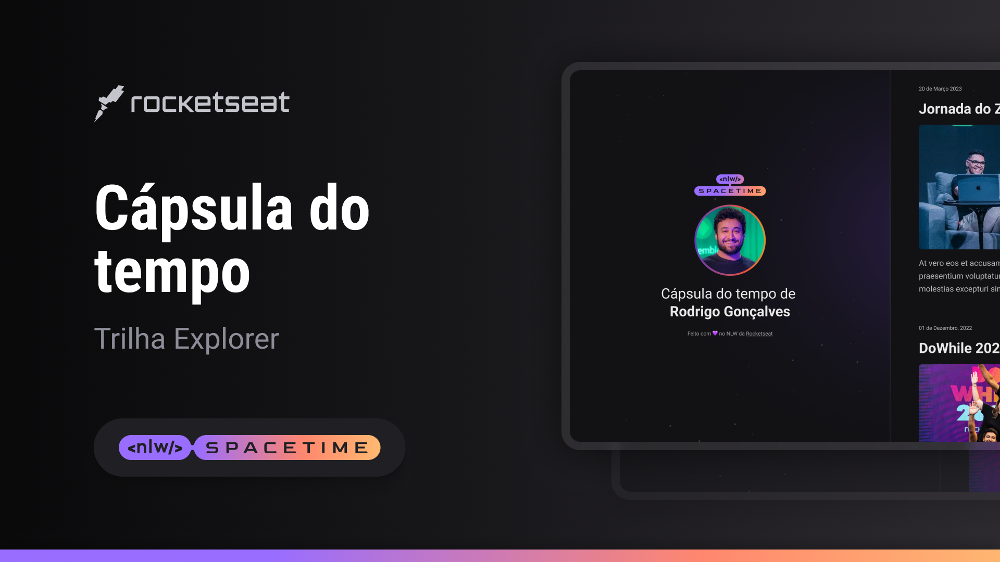

  

## 💻 Projeto
Esse é um projeto responsivo de uma capsula do tempo para exibir memórias em uma linha do tempo.

## 🚀 Tecnologias
Esse projeto foi desenvolvido durante a NLW da Rocketseat utilizando as tecnologias:

- HTML
- CSS
- GIT e GITHUB

## 🏷️ Layout
Você pode visualizar o layout do projeto através
[desse link](https://www.figma.com/file/dnfe1HbL63QGa3yAYTYXGQ/C%C3%A1psula-do-tempo-%E2%80%A2-Trilha-Explorer-(Community)?type=design&node-id=306%3A84&t=quAqTefltjeu3ExN-1).
É necessário ter conta no [Figma](https://www.figma.com)

